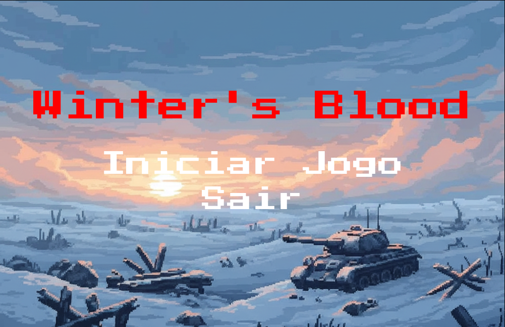
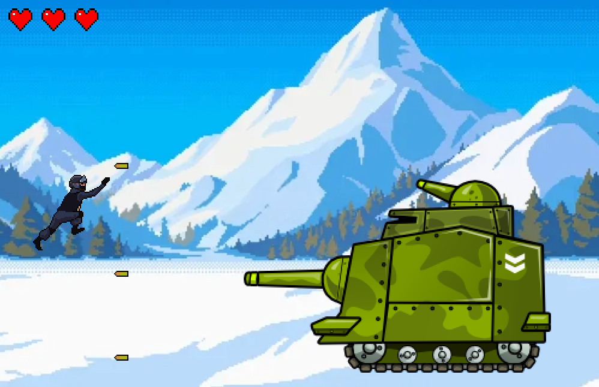

# 🎮 Winter's Blood - The Game

## 📋 Sobre o Projeto

**Winter Blood** é um jogo 2D do gênero **Run & Gun** desenvolvido em **C puro** com Allegro, inspirado nos clássicos **Contra** (Konami, 1987) e **Metal Slug** (SNK, 1996). 

Este projeto demonstra habilidades avançadas em programação de baixo nível, desenvolvimento de jogos e arquitetura de software, implementando mecânicas complexas de gameplay através de código otimizado e modular.

## 📸 Screenshots do Jogo

<div align="center">

### 🎮 Gameplay em Ação

*Personagem principal em combate contra inimigos*

### 🏠 Menu Principal

*Interface inicial do jogo com navegação intuitiva*

### ⚔️ Boss Fight

*Enfrentamento épico contra o chefe da fase*

### 🎯 HUD e Interface

*Sistema de vida, pontuação e elementos de UI*

</div>

### 🎯 O que é Run & Gun?

Os jogos **Run & Gun** são um subgênero dos jogos de ação e tiro, caracterizados por:
- **Jogabilidade rápida e intensa** baseada em reflexos
- **Movimento e tiro simultâneo** contra ondas de inimigos
- **Ação constante** com obstáculos em movimento
- **Progressão linear** através de fases desafiadoras

## 🛠️ Stack Tecnológica

| Tecnologia | Uso | Justificativa |
|------------|-----|---------------|
| **C** | Linguagem principal | Controle total do hardware e performance máxima |
| **Allegro** | Graphics & Input | Biblioteca cross-platform para multimedia |
| **Allegro Audio** | Áudio | Música e efeitos sonoros |
| **Allegro Font** | Texto | Renderização de fontes para UI |
| **Allegro Image** | Texturas | Suporte a múltiplos formatos de imagem |
| **Makefile** | Build system | Compilação automatizada e otimizada |

## ✅ Funcionalidades Implementadas

### 🎯 Core Features
- [x] **Jogo Singleplayer** - Experiência completa para um jogador
- [x] **Sistema de Menu** - Interface intuitiva para navegação
- [x] **Telas de Estado** - Game Over, Vitória e transições fluidas

### 👤 Sistema do Personagem Principal
- [x] **Sprites Completos** - Estados visuais para idle, movimento, pulo, agachado e combate
- [x] **Controles Responsivos** - Movimento em 8 direções com física realista
- [x] **Sistema de Combate** - Arma com projéteis e feedback visual
- [x] **Animações Fluidas** - Transições suaves entre estados

### ⚔️ Sistema de Batalha
- [x] **Sistema de Vida** - HP dinâmico com feedback visual
- [x] **Collision Detection** - Sistema preciso para todas as interações
- [x] **Dano Visual** - Indicadores claros de impacto e status

### 🌍 Ambiente de Jogo
- [x] **Cenários Dinâmicos** - Background parallax com movimento fluido
- [x] **Level Design** - Fase balanceada com progressão natural
- [x] **Assets Customizados** - Arte original e sprites otimizados

### 👹 Sistema de Inimigos & AI
- [x] **Múltiplos Tipos** - Inimigos com comportamentos únicos
- [x] **Boss Fights** - Chefes com mecânicas especiais e padrões de ataque
- [x] **IA Comportamental** - Algoritmos de movimento e ataque adaptativos
- [x] **Spawn System** - Aparição estratégica de inimigos pela fase

## 🏗️ Arquitetura Modular

```
WinterBloodTheGame/
├── src/
│   ├── main.c           # Entry point e game loop principal
│   ├── player.c         # Lógica do jogador e controles
│   ├── enemy.c          # IA e comportamentos dos inimigos
│   ├── boss.c           # Lógica específica dos chefes
│   ├── bullet.c         # Sistema de projéteis e física
│   ├── animation.c      # Engine de animações sprite-based
│   ├── controls.c       # Sistema de entrada e controles
│   └── item.c           # Sistema de itens e power-ups
├── include/
│   ├── config.h         # Configurações globais e constantes
│   ├── player.h         # Definições do sistema de jogador
│   ├── enemy.h          # Estruturas dos inimigos
│   ├── boss.h           # Interface dos boss fights
│   ├── bullet.h         # Sistema de projéteis
│   ├── animation.h      # Sistema de animações
│   ├── controls.h       # Controles e input
│   └── item.h           # Sistema de itens
├── assets/              # Todas as imagens utilizadas no jogo
├── Makefile             # Sistema de build automatizado
└── README.md            # Documentação completa
```

## 🎮 Controles

| Ação | Tecla | Descrição |
|------|-------|-----------|
| **Movimento** | `←→↑↓` | Movimentação em 8 direções |
| **Pular** | `SPACE` | Pulo com física realista |
| **Atirar** | `X` | Disparo de projéteis |
| **Agachar** | `S` | Posição defensiva |
| **Menu** | `ESC` | Pausar/voltar ao menu |

## 📦 Compilação e Execução

### Pré-requisitos (Allegro)
```bash
# Ubuntu/Debian
sudo apt-get install liballegro5-dev

# Fedora/CentOS
sudo dnf install allegro5-devel

# Arch Linux
sudo pacman -S allegro
```

### Build System (Makefile)
```bash
# Clone o repositório
git clone https://github.com/KaueAmorim/WinterBloodTheGame.git
cd WinterBloodTheGame

# Compilar o projeto
make

# Executar o jogo
./game

# Limpar arquivos compilados
make clean
```

## 🎯 Competências Demonstradas

### 💻 Programação de Baixo Nível
- **C Puro**: Desenvolvimento sem frameworks de alto nível
- **Gerenciamento Manual de Memória**: Controle total de recursos
- **Ponteiros e Estruturas**: Manipulação avançada para sistemas complexos
- **Otimização**: Loops eficientes e minimização de alocações

### 🎮 Desenvolvimento de Jogos
- **Game Loop**: Implementação de update/render cycles
- **Collision Detection**: Algoritmos precisos para interações
- **State Machines**: Gerenciamento de estados de jogo
- **Sprite Animation**: Sistema customizado frame-based

### 🔧 Engenharia de Software
- **Código Modular**: Separação clara de responsabilidades
- **Arquitetura Limpa**: Interfaces bem definidas
- **Sistema de Build**: Makefile robusto com make/make clean
- **Tratamento de Erros**: Validação e recuperação adequadas